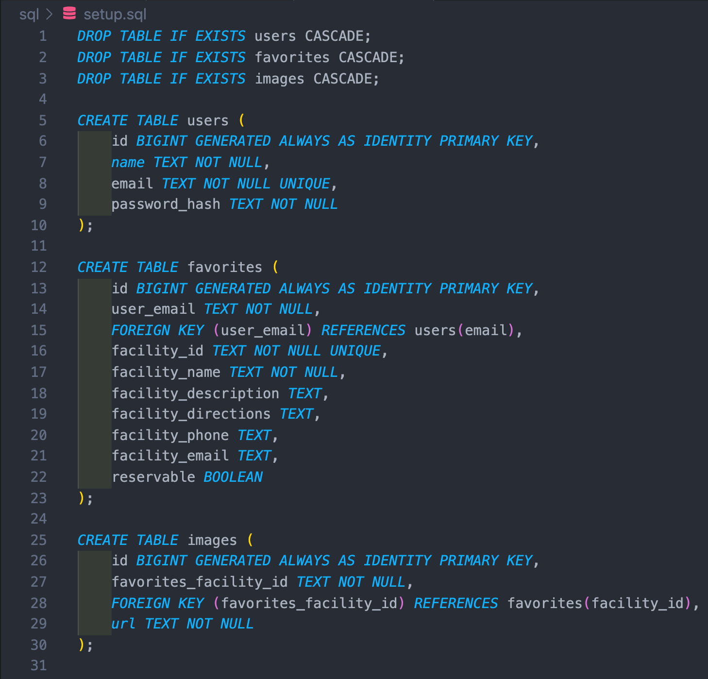

## Project Description:

Alcode Campgrounds is a single-page web application designed to help people identify locations where they’d like to camp within the United States. Accessing campsite and facility data contained within Recreation.gov through their public API, we offer sign-in through Google OAuth and deploy our website through Netflify. Users are able to search for campgrounds by US states, pan around a MapBox view rendering all returned sites, click on a marker to show campground details and photos, and store favorites within their user profile.

## Dev Team:

Tanner Meck, Cristian Montes, Justin Soto, Alan Willoughby

## Overall Architectural Pattern:

Alcode Campgrounds was built using the models-views-controllers architecture to follow the separation of concerns principle. This form of architecture allows the view functions on the frontend to use the endpoints, models, and services to interact with the PostgreSQL database on the backend.

## Database Design:

Our PostgreSQL tables are named users, favorites, and images – our users table stores the name, email, and password of each user, our favorites table references our users table via the email key and holds data relating to various facilities key data, and our images table references the favorites table’s facility id and stores the images relating to each campsite.

## Image of Tables:

## Frontend Architecture:

The frontend of our code was designed using the principles of flux architecture and utilizes context API to manage global state needed across the app. Alcode has seven views for the user to interact with and five reusable components rendered within them.

## Technologies:

| Frontend Tech       | Backend Tech  |
| ------------------- | ------------- |
| MSW                 | Express       |
| React               | CORS          |
| React-router-dom v6 | cookie-parser |
| Mapbox-gl           | bcryptjs      |
| Jest                | Axios         |
| Netlify             | SuperTest     |
| Sass                | Jest          |
| HTML                | Heroku        |
|                     | Node          |
|                     | PostgreSQL    |
